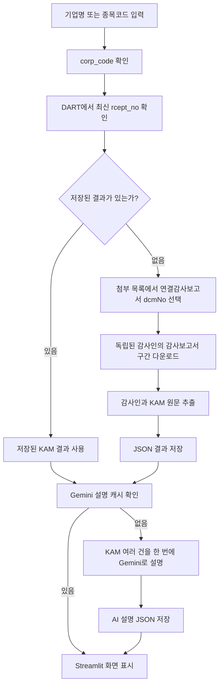

# DART 핵심감사사항(KAM) 조회 도구 — 간단 MVP 설계서

> 이 문서는 구현 방향을 빠르게 이해하기 위한 간단 버전이다.  
> 상세 요구사항과 예외 처리는 [`dart-kam-prd.md`](./dart-kam-prd.md)를 참고한다.  
> 작성일: 2026-07-20 / AI 쉬운 설명 추가: 2026-07-22

## 1. 무엇을 만드는가?

사용자가 상장기업명 또는 6자리 종목코드를 입력하면 DART에서 해당 기업의 최신 사업보고서를 찾아 다음 내용을 보여주는 Streamlit 앱을 만든다.

- 기업명과 종목코드
- 사업연도와 DART 접수번호
- 연결 또는 별도 감사보고서 구분
- 감사를 수행한 회계법인명
- 핵심감사사항(KAM) 제목
- KAM을 두 문장 이내로 정리한 초보자용 설명
- 왜 중요한지와 감사인이 무엇을 했는지에 대한 쉬운 설명
- 어려운 회계용어 최대 3개의 풀이
- DART 원문 링크

MVP에서는 **연결감사보고서를 우선 조회**하고, 연결감사보고서가 명확히 없을 때 별도감사보고서를 사용한다.

## 2. 먼저 알아야 할 번호 3개

| 이름 | 쉬운 의미 | 사용처 |
|---|---|---|
| `corp_code` | DART에서 사용하는 회사 고유번호 | DART API로 회사를 조회할 때 사용 |
| `stock_code` | 투자자가 사용하는 6자리 종목코드 | 사용자 입력과 회사 검색에 사용 |
| `rcept_no` | DART에 제출된 공시문서 한 건의 접수번호 | 사업보고서 원문 조회와 결과 저장에 사용 |

쉽게 말하면 다음과 같다.

- `corp_code`: 어느 회사인가?
- `stock_code`: 주식시장에서 어떤 종목인가?
- `rcept_no`: 그 회사가 제출한 어느 문서인가?

사용자가 `stock_code`를 입력하면 앱이 이를 `corp_code`로 변환해 DART API를 호출한다.

## 3. MVP의 핵심 원칙

1. 핵심 결과는 `KAM_RESULT`라는 하나의 논리적 테이블에 모은다.
2. 데이터베이스는 아직 연결하지 않는다.
3. 조회할 때 DART에서 최신 접수번호를 확인한다.
4. 이미 처리한 접수번호이면 저장된 결과를 재사용한다.
5. 새로운 접수번호이면 원문을 다시 받아 KAM을 추출한다.
6. 결과는 접수번호별 JSON 파일로 저장한다.
7. 감사인명을 찾지 못하거나 파싱이 불확실하면 추정하지 않는다.

코드는 API 호출, 문서 파싱, 화면 표시처럼 역할별로 나누되, 사용자가 이용하는 핵심 결과 형식은 하나로 유지한다.

## 4. 전체 처리 흐름



## 5. 핵심 테이블: `KAM_RESULT`

`KAM_RESULT`는 실제 데이터베이스 테이블이라기보다 **앱 전체에서 공통으로 사용하는 결과 형식**이다.

KAM 하나를 한 행으로 본다. 하나의 감사보고서에 KAM이 3개라면 결과는 3행이다. 이 경우 기업명, 접수번호, 감사인명 등은 각 행에 반복해서 들어가도 괜찮다.

| 칼럼 | 의미 |
|---|---|
| `id` | 결과 행의 고유번호 |
| `corp_code` | DART 회사 고유번호 |
| `stock_code` | 6자리 종목코드 |
| `corp_name` | 회사명 |
| `rcept_no` | 사업보고서 접수번호 |
| `report_period_end` | 사업보고서 기준일 |
| `rcept_date` | DART 접수일 |
| `is_amended` | 정정공시 여부 |
| `report_scope` | `consolidated` 또는 `separate` |
| `auditor_name` | 감사를 수행한 회계법인명 |
| `kam_no` | 문서에 나타난 KAM 순서 |
| `kam_title` | KAM 제목 |
| `why_kam` | KAM 선정 이유 원문 |
| `audit_response` | 감사인의 대응 원문 |
| `raw_text` | 해당 KAM 전체 원문 |
| `status` | 성공, KAM 없음, 파싱 실패 등 |
| `confidence` | 추출 신뢰도 |
| `source_url` | DART 원문 링크 |
| `source_locator` | 원문 파일명, XML 위치 또는 PDF 페이지 |
| `parser_version` | 추출 프로그램 버전 |
| `extracted_at` | 추출 시각 |

## 6. 감사인 정보 처리

결과에는 선택된 감사보고서의 회계법인명을 표시한다.

- 연결감사보고서를 사용했다면 연결감사보고서의 감사인명을 표시한다.
- 연결감사보고서가 없어 별도감사보고서를 사용했다면 별도감사보고서의 감사인명을 표시한다.
- 감사인명을 확실하게 찾지 못하면 빈 값을 추정해서 채우지 않는다.
- 찾지 못한 경우 `auditor_not_identified` 경고와 DART 원문 링크를 보여준다.

MVP는 최신 보고서에 대한 감사인 한 곳을 보여준다. 과거 감사인 변경 이력과 연결·별도 감사인 비교는 후속 기능으로 둔다.

## 7. 최신 조회와 기록 저장 방식

MVP는 **실시간 최신 확인 + 로컬 결과 저장** 방식을 사용한다.

### 처음 조회하는 경우

1. DART에서 최신 사업보고서의 `rcept_no`를 확인한다.
2. 원문을 다운로드한다.
3. 감사인명과 KAM을 추출한다.
4. `rcept_no`를 이름으로 한 JSON 파일에 결과를 저장한다.
5. 화면에 결과를 보여준다.

### 같은 문서를 다시 조회하는 경우

1. DART에서 최신 `rcept_no`를 확인한다.
2. 저장된 `rcept_no`와 같으면 기존 결과를 사용한다.
3. 감사보고서 첨부 다운로드와 파싱을 반복하지 않는다.

### 정정공시 또는 새 사업보고서가 나온 경우

1. 최신 `rcept_no`가 기존 결과와 달라진다.
2. 새 문서를 다운로드하고 다시 추출한다.
3. 새 JSON 파일로 저장한다.
4. 기존 JSON은 삭제하지 않는다.

따라서 항상 최신 여부는 확인하면서도 같은 문서를 불필요하게 반복 처리하지 않는다.

## 8. JSON 캐시 구조

결과 파일은 다음처럼 저장한다.

```text
data/cache/dart/
├── 20250311000123.json
├── 20250318000456.json
└── 20260312000234.json
```

간단한 저장 예시는 다음과 같다.

```json
{
  "corp_name": "ABC회사",
  "corp_code": "00123456",
  "stock_code": "123456",
  "rcept_no": "20250311000123",
  "report_period_end": "2024-12-31",
  "report_scope": "consolidated",
  "auditor_name": "OO회계법인",
  "status": "success",
  "confidence": "high",
  "kam_items": [
    {
      "kam_no": 1,
      "kam_title": "재고자산 평가",
      "why_kam": "원문",
      "audit_response": "원문",
      "raw_text": "전체 원문"
    }
  ],
  "parser_version": "1.0.0",
  "extracted_at": "2026-07-20T14:30:00+09:00"
}
```

로컬 JSON은 데이터베이스가 아니라 재사용 가능한 결과 스냅샷이다. 추후 DB를 도입할 때 이 JSON들을 마이그레이션할 수 있다.

## 9. 결과 상태

| 상태 | 의미 |
|---|---|
| `success` | KAM을 정상적으로 추출함 |
| `company_not_found` | 입력한 상장기업을 찾지 못함 |
| `annual_report_not_found` | 사업보고서를 찾지 못함 |
| `auditor_not_identified` | 회계법인명을 확실하게 찾지 못함 |
| `kam_not_present` | 감사보고서는 있지만 KAM이 명시적으로 없음 |
| `parse_failed` | KAM 징후는 있지만 안정적으로 추출하지 못함 |
| `manual_review_required` | 연결·별도 구분 등 자동 판단이 불확실함 |

`kam_not_present`와 `parse_failed`는 의미가 다르므로 반드시 구분한다.

## 10. 현재 버전에서 하지 않는 것

- 정식 데이터베이스 연결
- 사용자별 조회 이력 화면
- 여러 연도의 KAM 비교
- 연결·별도 감사보고서 동시 비교
- 감사인 변경 이력
- 여러 기업 일괄 조회
- 스캔 PDF OCR

## 11. 나중에 확장하는 방법

현재 JSON 결과를 바탕으로 다음 기능을 순서대로 추가할 수 있다.

1. SQLite를 연결해 과거 조회 결과를 검색한다.
2. 같은 기업의 연도별 KAM을 비교한다.
3. 여러 기업의 KAM을 업종별로 비교한다.
4. 감사인 변경 이력을 표시한다.
5. 결과를 Excel 또는 CSV로 내려받는다.
6. 업종별 배경지식과 함께 KAM을 비교 설명한다.

데이터 중복이나 조회 성능이 실제 문제가 될 때 `COMPANY`, `FILING`, `AUDIT_REPORT`, `KAM_ITEM` 등으로 테이블을 분리한다. 처음부터 복잡하게 나누지 않는다.

## 12. MVP 완료 기준

- 기업명 또는 종목코드로 상장기업을 찾을 수 있다.
- 최신 사업보고서와 정정공시 여부를 확인할 수 있다.
- 선택된 감사보고서의 연결·별도 구분과 회계법인명이 표시된다.
- KAM 제목과 초보자용 설명이 기본으로 표시되고, 원문은 별도 **원문 보기**에서만 표시된다.
- 같은 접수번호와 같은 추출 내용은 저장된 AI 설명을 재사용한다.
- 동일 접수번호를 다시 조회하면 저장된 결과를 재사용한다.
- 새 접수번호가 발견되면 새로 추출하고 기존 기록을 보존한다.
- KAM 없음과 파싱 실패를 구분한다.
- 모든 결과 또는 오류에 가능한 경우 DART 원문 링크를 제공한다.

## 13. 구현 순서

1. `corp_code` 기업 검색
2. 최신 사업보고서와 `rcept_no` 확인
3. 접수번호별 JSON 캐시 읽기·쓰기
4. DART 뷰어 첨부 목록에서 연결감사보고서 `dcmNo` 선택
5. 첨부의 `독립된 감사인의 감사보고서` 구간 다운로드
6. 연결·별도 감사보고서 구분과 감사인명 추출
7. 선택된 감사보고서 안에서만 KAM 원문 추출
8. `KAM_RESULT` 형식으로 결과 변환
9. Streamlit 화면 표시
10. 대표 기업 문서로 결과 수동 대조
