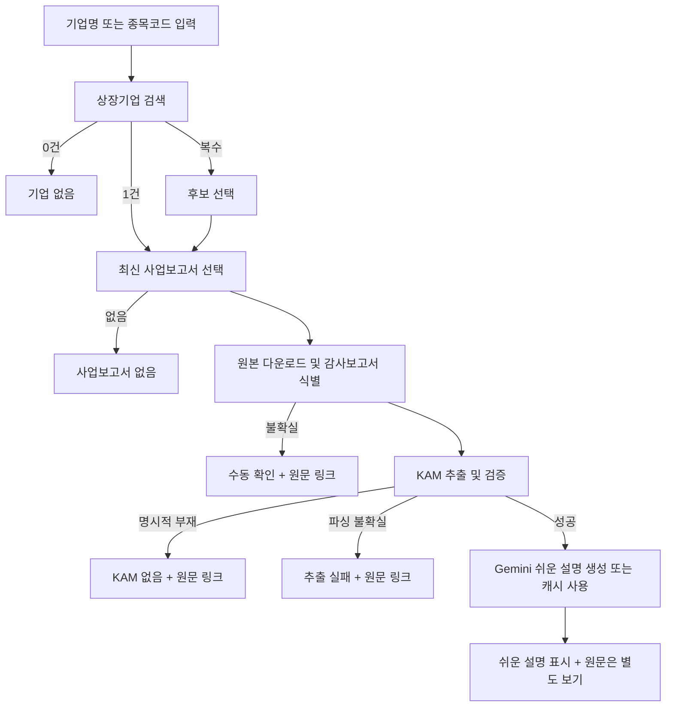

# DART 핵심감사사항(KAM) 추출·설명 도구 PRD v1.1

> 상태: MVP 구현 및 AI 쉬운 설명 확장
> 대상 릴리스: MVP+
> 최종 수정일: 2026-07-22

## 0. 한 줄 요약

상장기업명 또는 6자리 종목코드를 입력하면 DART의 최신 유효 사업보고서에서 감사보고서를 식별하고, **핵심감사사항(KAM)을 추출한 뒤 Gemini로 초보자도 이해하기 쉽게 설명**하며 원문은 별도 보기로 제공하는 Streamlit 앱이다.

## 1. 배경과 해결할 문제

감사팀 실무자는 감사 계획과 유사기업 벤치마킹 과정에서 DART 사업보고서를 검색하고, 감사보고서를 찾아, 핵심감사사항을 수작업으로 복사·정리한다. 이 과정은 기업마다 문서 구조와 표기가 달라 반복 비용이 크며, 연결·별도 감사보고서 또는 정정공시를 잘못 선택할 위험도 있다.

이 제품은 단순 검색이 아니라 다음 판단을 일관되게 자동화한다.

1. 입력이 어느 상장기업을 뜻하는지 식별한다.
2. 정정공시를 반영한 최신 유효 사업보고서를 고른다.
3. 여러 감사보고서 중 MVP 대상 문서를 정해진 규칙으로 선택한다.
4. KAM 원문을 누락이나 의역 없이 구조화한다.
5. 실제 KAM 부재와 추출 실패를 구분해 사용자에게 알린다.

## 2. 사용자와 핵심 사용 시나리오

### 2.1 주요 사용자

- 회계법인 감사팀의 Staff~Manager
- 특정 기업 또는 유사기업의 감사 이슈를 빠르게 파악하려는 품질관리·리서치 담당자

### 2.2 핵심 작업(JTBD)

> 감사 계획을 세울 때, 대상 기업의 최신 KAM을 빠르게 확인하고 원문과 대조해 감사 중점 영역을 파악하고 싶다.

### 2.3 대표 사용자 흐름

1. 사용자가 기업명 일부 또는 종목코드를 입력한다.
2. 검색 결과가 여러 건이면 상장기업 후보에서 하나를 선택한다.
3. 앱이 최신 유효 사업보고서와 대상 감사보고서를 자동 선택한다.
4. 앱이 KAM별 한눈 요약, 중요 이유, 감사 접근, 용어 풀이를 먼저 표시한다.
5. 정확한 문구가 필요한 사용자는 항목 안의 원문 보기 또는 DART 링크를 연다.

## 3. 목표, 성공 지표, 제외 범위

### 3.1 MVP 목표

- 일반적인 텍스트 기반 DART 사업보고서에서 KAM 조회 시간을 수분 이내로 줄인다.
- 결과마다 기업, 보고기간, 접수번호, 감사보고서 종류, 출처를 명확히 표시한다.
- 추출 결과가 불확실할 때 성공으로 가장하지 않고 수동 확인이 필요한 이유를 보여준다.
- 파싱 로직을 UI와 분리해 실제 문서 fixture로 회귀 테스트할 수 있게 한다.

### 3.2 출시 후 측정 지표

- 지원 fixture 기준 KAM 항목 경계 정확도 95% 이상
- 지원 fixture 기준 원문 문자 보존율 99.5% 이상(허용 정규화 제외)
- 정상 API 응답·캐시 적중 조건에서 조회 성공률 95% 이상
- 첫 결과 표시까지 중앙값 10초 이하, 95백분위 30초 이하
- 추출 성공 결과 중 사용자가 원문 대조 후 오류로 표시한 비율 2% 이하

초기에는 표본 수가 작으므로 위 수치는 출시 게이트이자 개선 목표로 사용한다.

### 3.3 MVP 제외 범위

- 여러 연도의 KAM 이력과 변경점 비교
- 연결·별도 감사보고서 동시 비교 또는 사용자의 보고서 종류 직접 선택
- 여러 기업 CSV 일괄 처리, CLI, 예약 실행
- 이미지로만 구성된 스캔 PDF의 OCR
- 비상장·코넥스 법인 조회
- KAM 내용을 근거로 한 감사 결론 또는 회계 판단 제공

## 4. 제품 및 데이터 정의

### 4.1 조회 대상 기업

- `corpCode.xml`에서 `stock_code`가 있는 유가증권·코스닥 상장기업만 MVP 대상으로 한다.
- 종목코드는 공백을 제거한 뒤 숫자 6자리와 정확히 일치해야 한다.
- 기업명은 괄호·주식회사 표기 등을 임의 제거하지 않고, 먼저 정규화된 정확 일치, 다음으로 부분 일치 순으로 후보를 제시한다.
- 후보에는 `corp_name`, `stock_code`, `corp_code`를 표시한다. 자동으로 첫 후보를 선택하지 않는다.

### 4.2 “최신 사업보고서”의 정의

OpenDART 공시검색 API에서 선택 기업의 사업보고서 상세 유형을 조회하고, 최종보고서 조건을 적용한다. 구현 시 공식 개발가이드의 최신 파라미터와 코드값을 다시 확인한다.

선택 규칙은 다음 순서로 고정한다.

1. 사업보고서만 남긴다. 분기·반기보고서와 증권신고서는 제외한다.
2. 동일 보고기간의 원본·정정본이 함께 있으면 DART가 최종보고서로 반환한 문서를 사용한다.
3. 보고기간 종료일 내림차순, 접수일 내림차순으로 정렬한다.
4. 보고기간을 파싱하지 못하면 접수일 내림차순을 폴백으로 쓰고 화면에 경고를 표시한다.
5. 최근 3년 범위에서 찾고, 없을 때 한 번만 10년 범위로 확장한다. 2년보다 오래된 보고서면 “최신 공시가 오래됨” 배지를 표시한다.

“가장 최근 접수된 문서”와 “가장 최근 사업연도 문서”를 혼동하지 않도록 보고기간을 우선한다. 선택된 문서가 정정공시이면 그 사실도 표시한다.

### 4.3 대상 감사보고서

- 기본 대상은 **연결재무제표에 대한 독립된 감사인의 감사보고서**다.
- 연결감사보고서가 명확히 없을 때만 별도/개별 감사보고서를 사용한다.
- 연결·별도 여부를 판정하지 못하면 임의 선택하지 않고 `manual_review_required`를 반환한다.
- 결과에 `report_scope = consolidated | separate`를 반드시 표시한다.
- 다른 감사보고서, 내부회계관리제도 감사보고서, 검토보고서는 KAM 후보에서 제외한다.

### 4.4 KAM 항목의 최소 구조

각 항목은 다음 필드를 갖는다.

| 필드 | 필수 | 설명 |
|---|---:|---|
| `title` | 예 | 문서에 기재된 KAM 제목 |
| `why_kam` | 예 | 해당 사항을 KAM으로 선정한 이유의 원문 |
| `audit_response` | 예 | 감사인이 수행한 대응 절차의 원문 |
| `raw_text` | 예 | 항목 전체 원문. 구조화 결과 대조용 |
| `source_file` | 예 | DART 첨부문서명과 `dcmNo` |
| `source_locator` | 아니요 | 감사보고서 목차의 `eleId` 등 원문 위치 정보 |

원문에 이유와 대응이 명시적으로 나뉘지 않으면 억지로 분할하지 않는다. 이 경우 `raw_text`만 보존하고 `manual_review_required` 경고를 붙인다.

## 5. 데이터 소스와 기술적 전제

### 5.1 사용하는 OpenDART 기능

- 고유번호: `corpCode.xml`
- 공시검색: `list.json`
- DART 공시 뷰어 첨부 목록: 사업보고서의 `rcept_no`별 첨부 `dcmNo` 식별
- DART 보고서 뷰어: 선택된 첨부의 `독립된 감사인의 감사보고서` 목차 구간 조회
- 감사인명 등 보조 메타데이터는 OpenDART의 정기보고서 주요정보 API 사용 가능 여부를 기술 스파이크에서 검증한다.

공식 기준은 [OpenDART 개발가이드](https://opendart.fss.or.kr/guide/main.do)이며, 엔드포인트·상태코드·요청 제한은 구현 시점의 가이드를 따른다.

### 5.2 XBRL을 사용하지 않는 이유

XBRL은 재무제표 계정과목과 금액처럼 구조화된 재무정보 조회에 적합하다. KAM은 사업보고서의 XBRL 본문이 아니라 별도 감사보고서 첨부에 있으므로, MVP는 DART 공시 뷰어에서 첨부 `dcmNo`와 감사보고서 목차 구간을 식별해 해당 HTML만 파싱한다.

### 5.3 문서 소스 우선순위

1. OpenDART에서 최신 사업보고서의 `rcept_no` 식별
2. DART 공시 뷰어의 첨부 목록에서 정확히 `연결감사보고서`인 `dcmNo` 우선 선택
3. 연결감사보고서가 없을 때만 정확히 `감사보고서`인 첨부 선택
4. 선택된 첨부의 목차에서 `독립된 감사인의 감사보고서` 구간만 조회
5. 해당 구간 안에서만 감사인명과 KAM 추출

DART 공시 뷰어 경로는 공개 화면에서 사용하는 경로이지만 OpenDART API로 문서화된 첨부 조회 API는 아니다. 따라서 HTML 구조 변경 위험을 테스트와 명확한 실패 상태로 관리한다.

## 6. 기능 요구사항

### FR-1. API 키와 시작 상태

- 앱은 `.env`의 `DART_API_KEY`를 읽는다.
- 키가 없으면 조회 UI보다 먼저 설정 안내를 보여준다.
- API 키를 화면, 로그, 예외 메시지, 캐시 키에 노출하지 않는다.

### FR-2. 기업 검색

- 종목코드는 정확 일치만 허용한다.
- 기업명 검색은 정확 일치를 위에, 부분 일치를 아래에 정렬한다.
- 결과가 0건이면 `company_not_found`, 2건 이상이면 `ambiguous_company` 상태를 반환한다.
- 후보를 선택하기 전에는 공시 API를 호출하지 않는다.

### FR-3. 사업보고서 선택

- 4.2의 규칙으로 한 건을 결정한다.
- `corp_name`, `stock_code`, `corp_code`, `report_name`, `report_period`, `rcept_no`, `rcept_date`, `is_amended`를 결과 메타데이터로 유지한다.
- DART 공시 뷰어 링크는 `https://dart.fss.or.kr/dsaf001/main.do?rcpNo={rcept_no}` 형식으로 생성하되, 구현 테스트에서 유효성을 확인한다.

### FR-4. 감사보고서 첨부 처리

- 사업보고서 전체 본문에서 `핵심감사사항` 문자열을 검색하지 않는다.
- 첨부 선택 목록에서 `연결감사보고서`를 정확 일치로 우선 선택하고 `dcmNo`를 보존한다.
- 선택된 첨부에서 `독립된 감사인의 감사보고서` 목차의 `eleId`, `offset`, `length`, `dtd`를 식별한다.
- 해당 목차 구간의 HTML만 내려받아 파싱한다.
- 인코딩 선언을 우선 사용하고, 실패하면 UTF-8, CP949, EUC-KR 순서로 제한해 시도한다.

### FR-5. 감사보고서 선택

- 파일명만으로 판정하지 않고 문서 제목·본문 헤딩을 함께 점수화한다.
- “연결재무제표”, “독립된 감사인의 감사보고서”, “핵심감사사항”을 긍정 신호로 사용한다.
- “내부회계관리제도”, “검토보고서”, “반기” 등은 제외 신호로 사용한다.
- 최고 점수 후보가 복수이거나 최소 기준에 못 미치면 자동 선택하지 않는다.

### FR-6. KAM 추출

- “핵심감사사항”과 관찰된 표기 변형을 헤딩 후보로 탐색한다.
- 감사보고서 내부의 KAM 섹션만 대상으로 하며, 목차나 본문에서 우연히 언급된 문자열은 제외한다.
- 항목 제목, 선정 이유, 감사인의 대응 경계를 결정론적 규칙으로 식별한다.
- 섹션 종료는 다음 동급 헤딩과 감사보고서 표준 섹션 전환을 기준으로 한다.
- HTML 태그 제거, 연속 공백 축소, 줄바꿈 통일 외의 요약·교정·번역을 하지 않는다.
- 추출기는 결과와 함께 근거 신호 및 신뢰도(`high | medium | low`)를 반환한다. `low`는 성공 화면이 아니라 수동 확인 상태로 처리한다.

### FR-7. 결과 표시

성공 시 화면 상단에 다음을 표시한다.

- 기업명과 종목코드
- 보고기간, 접수일, 접수번호, 정정공시 여부
- 연결/별도 구분과 감사인명
- 선택된 첨부문서명, `dcmNo`, 감사보고서 목차 위치와 신뢰도
- DART 원문 열기 링크

KAM은 접을 수 있는 항목 카드로 표시한다. 기본 화면에는 제목, 한눈 요약, 중요한 이유, 감사 접근, 용어 풀이를 제공한다. 선정 이유와 감사 대응 원문을 본문에 반복 노출하지 않고, 전체 원문은 별도의 **원문 보기** 안에서만 제공한다.

### FR-8. 캐시

- `corpCode.xml`은 로컬 파일로 저장하고 기본 TTL을 7일로 한다.
- 공시 목록은 기업별로 최대 1시간, 파싱 결과는 `rcept_no`와 파서 버전 기준으로 캐시한다.
- AI 설명은 `rcept_no`, 모델, 프롬프트 버전, 추출 원문의 지문을 기준으로 캐시한다.
- 손상된 캐시는 자동 폐기 후 한 번 다시 받는다.
- 사용자가 화면에서 캐시 갱신을 요청할 수 있게 한다.

### FR-9. 오류와 재시도

- 연결 시간 초과와 5xx 계열 일시 오류만 지수 백오프로 최대 2회 재시도한다.
- 인증키 오류, 요청 한도 초과, 잘못된 입력, 조회 결과 없음은 재시도하지 않는다.
- OpenDART 상태코드는 내부 오류 타입으로 매핑하되 원래 코드도 진단 로그에 남긴다. 사용자 화면에는 해결 방법 중심 메시지를 표시한다.

## 7. 결과 상태 모델

“KAM 없음”과 “추출 실패”는 감사 실무상 의미가 다르므로 반드시 구분한다.

| 상태 | 의미 | 사용자 행동 |
|---|---|---|
| `success` | KAM을 높은/중간 신뢰도로 구조화함 | 원문 대조 |
| `ambiguous_company` | 기업 후보가 여러 개임 | 후보 선택 |
| `company_not_found` | 대상 상장기업이 없음 | 입력 확인 |
| `annual_report_not_found` | 유효 사업보고서가 없음 | DART 수동 검색 |
| `source_download_failed` | 원본을 받거나 열지 못함 | 잠시 후 재시도 |
| `audit_report_not_identified` | 대상 감사보고서를 확정하지 못함 | 원문 수동 확인 |
| `kam_not_present` | 감사보고서는 확인했으나 KAM 섹션이 명시적으로 없음 | 적용 대상 여부 확인 |
| `parse_failed` | KAM 징후는 있으나 경계를 신뢰성 있게 추출하지 못함 | 원문 수동 확인 |
| `unsupported_scanned_pdf` | OCR이 필요한 문서임 | 원문 수동 확인 |
| `manual_review_required` | 복수 후보 또는 낮은 신뢰도로 자동 결론 불가 | 원문 수동 확인 |

모든 실패·수동 확인 상태에 가능한 경우 DART 원문 링크, 접수번호, 기술적 사유 코드를 함께 제공한다.

## 8. UX 요구사항



- 검색, 다운로드, 파싱 단계를 진행 표시로 구분한다.
- 이전 검색 결과가 남은 상태에서 새 검색이 시작되면 오래된 결과임을 명확히 표시하거나 즉시 숨긴다.
- 오류 메시지는 “무엇이 실패했는지 + 사용자가 무엇을 할 수 있는지”를 함께 말한다.
- 기본 설명은 데스크톱과 모바일에서 빠르게 읽을 수 있게 하고, 긴 원문은 접힌 상태를 유지한다.

## 9. 제안 아키텍처

```text
src/forcpa/dart/
├── api_client.py       # 인증, 타임아웃, 재시도, 상태코드 매핑
├── corp_codes.py       # corpCode.xml 캐시와 기업 검색
├── filings.py          # 사업보고서 조회·선택 규칙
├── viewer.py           # DART 첨부 dcmNo와 감사보고서 목차 구간 선택
├── audit_report.py     # 연결/별도 감사보고서 후보 식별
├── kam_extractor.py    # 결정론적 KAM 경계 탐색·구조화
├── models.py           # 결과·오류·KAM 데이터 모델
├── service.py          # 전체 유스케이스 오케스트레이션
└── app.py              # Streamlit UI

tests/
├── unit/
├── integration/
└── fixtures/dart_kam/
```

UI는 OpenDART 응답이나 파서 내부 구조를 직접 다루지 않고 `service.py`의 타입이 지정된 결과만 렌더링한다. 네트워크 호출, 문서 선택, 텍스트 추출은 각각 독립 테스트가 가능해야 한다.

권장 핵심 모델:

```python
KamResult(status, company, filing, audit_report, items, warnings, source_url)
KamItem(title, why_kam, audit_response, raw_text, source_locator)
```

## 10. 비기능 요구사항

### 10.1 안정성과 성능

- 모든 외부 요청에 연결·읽기 타임아웃을 둔다.
- 다운로드 크기와 ZIP 해제 후 전체 크기에 상한을 둔다.
- 파싱 한 건의 실행 시간을 제한하고 실패 시 프로세스 전체가 중단되지 않게 한다.
- 동일 접수번호에 대한 중복 API 요청을 피한다.

### 10.2 보안과 감사 가능성

- API 키와 환경변수를 로그에 기록하지 않는다.
- Gemini API 키는 Streamlit 서버에서만 사용하고 사용자 브라우저로 보내지 않는다.
- Gemini에는 공개 공시에서 추출한 KAM 문구만 보내며 `store=false`로 요청한다.
- 무료 등급에서 입력과 출력이 Google 제품 개선에 사용될 수 있음을 운영 문서에 알린다.
- ZIP 파일명을 신뢰하지 않고 안전한 임시 디렉터리 안에서만 처리한다.
- 결과마다 `rcept_no`, 원본 URL, 선택된 내부 파일명, 파서 버전을 기록해 재현 가능하게 한다.
- 사용자 입력과 공개 공시 원문 외의 개인정보를 수집하지 않는다.

### 10.3 접근성과 가독성

- 상태를 색상만으로 구분하지 않는다.
- 긴 원문은 적절한 행간과 너비를 유지하고, 표가 깨져도 읽는 순서를 보존한다.
- 복사한 원문에 UI 라벨이나 숨은 텍스트가 섞이지 않아야 한다.

## 11. 기술 스파이크 — 구현 전 필수 게이트

대표성 있는 상장기업 최소 5개, 최근 사업연도 2개 이상을 선정한다. 다음 변형을 포함한다.

- 연결·별도 감사보고서가 모두 있는 기업
- KAM이 1개인 기업과 여러 개인 기업
- 정정 사업보고서가 있는 기업
- 표 중심 문서와 문단 중심 문서
- 비표준 인코딩 또는 비표준 첨부명 문서

각 표본에서 아래 질문에 답하고 `docs/dart-kam-spike.md`에 근거를 남긴다.

1. 사업보고서별 첨부 선택 목록과 `dcmNo` 표현은 일관적인가?
2. 연결·별도 감사보고서를 어떤 신호로 안정적으로 구분할 수 있는가?
3. KAM 항목 제목·선정 이유·대응의 실제 표기 변형은 무엇인가?
4. 감사인명과 보고기간을 원문에서 안정적으로 얻을 수 있는가, 보조 API가 필요한가?
5. 뷰어 HTML 구조가 바뀌었을 때 안전하게 실패하는가?

### 스파이크 통과 조건

- 최소 10개 기업-연도 문서 중 8개 이상에서 대상 감사보고서를 정확히 선택한다.
- 그중 텍스트 기반 KAM 문서는 항목 수와 원문 경계를 100% 수동 대조한다.
- 실패 사례가 `kam_not_present`, `parse_failed`, `unsupported` 중 하나로 설명 가능하다.
- 통과하지 못하면 규칙을 보완하거나 MVP를 “KAM 섹션 원문 전체 제공”으로 축소하고 항목별 분할을 후속 버전으로 미룬다.

## 12. 테스트 전략

### 12.1 단위 테스트

- 기업명 정규화, 정확/부분 일치, 종목코드 검증
- 정정공시와 보고기간을 포함한 최신 문서 선택
- OpenDART 상태코드별 오류 매핑
- ZIP 경로 순회·손상 파일·과대 파일 차단
- 헤딩 변형, 표/문단, 복수 KAM, KAM 없음 경계 추출
- 공백·개행 외 원문이 바뀌지 않는지 검증

### 12.2 fixture 원칙

- 네트워크 없이 재현되는 소형 XML/HTML fixture를 기본으로 한다.
- 실제 공시에서 만든 fixture에는 출처 접수번호와 수집일을 메타데이터로 남긴다.
- 실제 DART 뷰어 HTML 전체는 저장소에 직접 커밋하지 않고 최소 구조 fixture로 관리한다.
- 실제 회사명이나 문구를 변형한 합성 fixture와 실제 구조 기반 fixture를 함께 둔다.

### 12.3 통합·UI 테스트

- API 응답은 녹화본 또는 mock으로 고정하고 라이브 API 테스트는 별도 표시한다.
- 검색 → 후보 선택 → 결과 표시 → 원문 링크 흐름을 테스트한다.
- 새 검색 시 이전 결과가 남지 않는지, 오류 상태별 안내가 맞는지 확인한다.
- 배포 전 스파이크 표본으로 원문 수동 대조 체크리스트를 수행한다.

## 13. 인수 기준

### AC-1. 정상 추출

**Given** 지원되는 상장기업과 최신 텍스트 기반 감사보고서가 있고  
**When** 사용자가 기업명 또는 종목코드로 조회하면  
**Then** 연결 우선 규칙으로 선택된 보고서의 모든 KAM이 항목별 원문으로 표시되고, 접수번호·보고기간·보고서 종류·원문 링크가 함께 보인다.

### AC-2. 동명·유사 기업

**Given** 기업명 검색 결과가 여러 건이면  
**When** 검색 결과가 표시될 때  
**Then** 앱은 임의 선택하지 않고 기업명과 종목코드가 포함된 후보 선택을 요구한다.

### AC-3. 정정공시

**Given** 같은 보고기간의 원본과 정정 사업보고서가 있으면  
**When** 최신 사업보고서를 선택할 때  
**Then** 최종 유효 문서를 사용하고 정정공시임을 화면에 표시한다.

### AC-4. KAM 부재와 파싱 실패 구분

**Given** 감사보고서에 KAM이 명시적으로 없거나 KAM 징후는 있으나 구조화에 실패한 경우  
**When** 결과를 반환하면  
**Then** 각각 `kam_not_present`와 `parse_failed`로 구분하고 원문 링크를 제공한다.

### AC-5. 원문 보존

**Given** 추출 성공 결과가 있으면  
**When** fixture의 기대 원문과 비교할 때  
**Then** 허용된 공백·개행 정규화 외에 요약, 누락, 문장 재배열, 번역이 없다.

### AC-6. 장애 처리

**Given** 인증 오류, 요청 한도 초과, 일시적 네트워크 오류가 발생하면  
**When** 조회가 끝날 때  
**Then** 앱이 오류 유형에 맞는 메시지와 다음 행동을 보여주며 잘못된 빈 결과를 성공으로 표시하지 않는다.

## 14. 구현 단계와 출시 게이트

### Phase 0. 기술 스파이크

- 공식 API 파라미터·상태코드 확인
- 대표 문서 수집과 구조 분석
- 감사보고서 선택 및 KAM 경계 규칙 검증
- 첨부 `dcmNo`와 감사보고서 목차 구간 선택 규칙 검증

### Phase 1. 데이터 수집 기반

- API 클라이언트, 기업 검색, 캐시
- 최신 유효 사업보고서 선택
- 타입이 지정된 결과·오류 모델

### Phase 2. 추출 엔진

- DART 첨부 및 감사보고서 구간 로더
- 연결/별도 감사보고서 판별
- KAM 섹션과 항목 구조화
- fixture 기반 회귀 테스트

### Phase 3. Streamlit UI

- 검색·후보 선택·진행 상태·결과 카드
- 실패/수동 확인 상태와 원문 링크
- 캐시 갱신, 원문 복사

### 출시 게이트

- 모든 인수 기준 통과
- 스파이크 표본 수동 대조 완료
- API 키 비노출, ZIP 안전성, 타임아웃 테스트 통과
- 미지원 문서가 성공으로 오분류되지 않음

## 15. 주요 위험과 대응

| 위험 | 영향 | 대응 |
|---|---|---|
| 회사·연도별 DART 문서 구조 차이 | 누락 또는 잘못된 경계 | 스파이크, 다중 신호 점수화, 실제 fixture 회귀 테스트 |
| 연결/별도 보고서 혼동 | 잘못된 KAM 제공 | 연결 우선 규칙, 결과 라벨, 불확실하면 수동 확인 |
| KAM 부재와 파싱 실패 혼동 | 잘못된 감사 판단 유도 | 별도 상태 모델과 근거 신호 저장 |
| 정정공시 선택 오류 | 오래된 원문 제공 | 보고기간·최종보고서 기반 선택과 정정 배지 |
| DART 뷰어 HTML 구조 변경 | 첨부 또는 본문 식별 실패 | 최소 fixture 회귀 테스트, 명확한 실패 상태, 원문 링크 제공 |
| DART 요청 제한·장애 | 조회 불가 | 캐시, 제한적 재시도, 해결 방법이 있는 오류 메시지 |
| 원문 변형 | 대조 가능성 저하 | 최소 정규화, `raw_text`, 문자 보존 회귀 테스트 |

## 16. 후속 버전 후보

1. 연결·별도 감사보고서 선택 및 나란히 비교
2. 동일 기업의 연도별 KAM 이력과 변경점 비교
3. 업종·기업군 단위 KAM 키워드 집계
4. 업종·계정과목 배경지식을 결합한 심화 AI 설명
5. 여러 기업 CSV 일괄 조회와 결과 내보내기
6. 스캔 PDF OCR 및 페이지 하이라이트
7. 사용자 오류 신고와 파서 회귀 fixture 자동 생성 흐름

## 17. 의존성과 실행 방법(예정)

현재 루트 `requirements.txt`에는 `streamlit`과 `pdfplumber`가 없으므로 구현 시 명시적으로 추가해야 한다. 최소 후보는 다음과 같다.

- `requests`, `python-dotenv`
- `streamlit`
- `beautifulsoup4`, `lxml`
- 테스트용 `pytest`, `responses` 또는 동등한 HTTP mock 도구

```powershell
python -m venv .venv
.venv\Scripts\Activate.ps1
pip install -r requirements.txt
# .env에 DART_API_KEY=발급받은키 추가
streamlit run src/forcpa/dart/app.py
```

## 18. 구현 전 확정할 의사결정

아래 항목은 Phase 0 결과를 반영해 체크하고 구현을 시작한다.

- [ ] 공시검색 API의 사업보고서 상세 유형·최종보고서 파라미터 확인
- [ ] 보고기간 파싱 규칙과 정정공시 선택 규칙 검증
- [ ] 연결·별도 감사보고서 구분 신호 확정
- [ ] 감사인명 취득 방식 확정(원문 파싱 또는 보조 API)
- [x] DART 뷰어에서 첨부 `dcmNo`와 감사보고서 목차 구간 조회 경로 확인
- [ ] 다운로드·압축 해제 크기 상한 확정
- [ ] 스파이크 대상 기업과 기대 KAM 항목 수 기록
